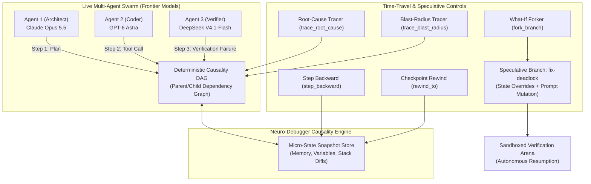

# ❖ Neuro-Debugger

> **Time-Travel Reverse Execution, Causality DAG & What-If Branch Forker for Multi-Agent Swarms**  
> Enables deterministic reverse-stepping, historical memory snapshot inspection, root-cause graph traversal, and speculative reality forking across distributed swarms running **Claude Opus 5.5**, **GPT-6 Astra**, and **DeepSeek V4.1-Flash**.

[](LICENSE)
[](https://python.org)
[]()
[]()

---

## ⚡ The Problem: The Agent Swarm Observability Black Box

Debugging autonomous multi-agent systems today is like debugging multi-threaded C code with print statements:
1. **Opaque Distributed Cascades**: When 50 agents interact across terminal, browser, and database tools, a failure at step 140 is caused by a subtle hallucination or variable pollution at step 22.
2. **Irreversible Execution**: Developers cannot "step back" in agent time to inspect intermediate variable states or model chain-of-thought activations.
3. **Expensive Hypothesis Testing**: Testing an alternative prompt or tool output requires re-running the entire expensive swarm workflow from scratch.

**Neuro-Debugger** solves this with **Deterministic Causality Time Travel**:
* **Frame-by-Frame Reverse Stepping**: Step backward and forward through agent thought trees and memory states with zero token re-computation.
* **Bidirectional Causality DAG**: Trace the exact backward ancestry (root cause) of any bug, or compute the forward blast-radius of any state mutation.
* **Speculative Causality Forking**: Pause execution at any historical step, modify prompt traits or variables, and branch off an alternate timeline while freezing the parent lineage.

---

## 📐 Architecture & Causality Flow



---

## 🚀 Key Modules
- **`neuro_debugger/causality_dag.py`**: High-performance dependency graph tracking direct parentage, downstream effects, and causal depth.
- **`neuro_debugger/time_travel_engine.py`**: Cursor-based execution history manager providing reversible stepping and branch management.
- **`neuro_debugger/models.py`**: Type-safe definitions for `ExecutionStep`, `StateSnapshot`, `CausalityNode`, and `ForkBranch`.
- **`neuro_debugger/cli.py`**: Command-line demonstration of live reverse-stepping, blast-radius calculation, and speculative branch forking.

---

## 🛠️ Installation & Usage

```bash
git clone https://github.com/AAH20/neuro-debugger.git
cd neuro-debugger
pip install -e .
```

### Run Demonstration
```bash
neuro-debugger --demo
```

### Run Unit Tests
```bash
python3 -m unittest discover tests
```
